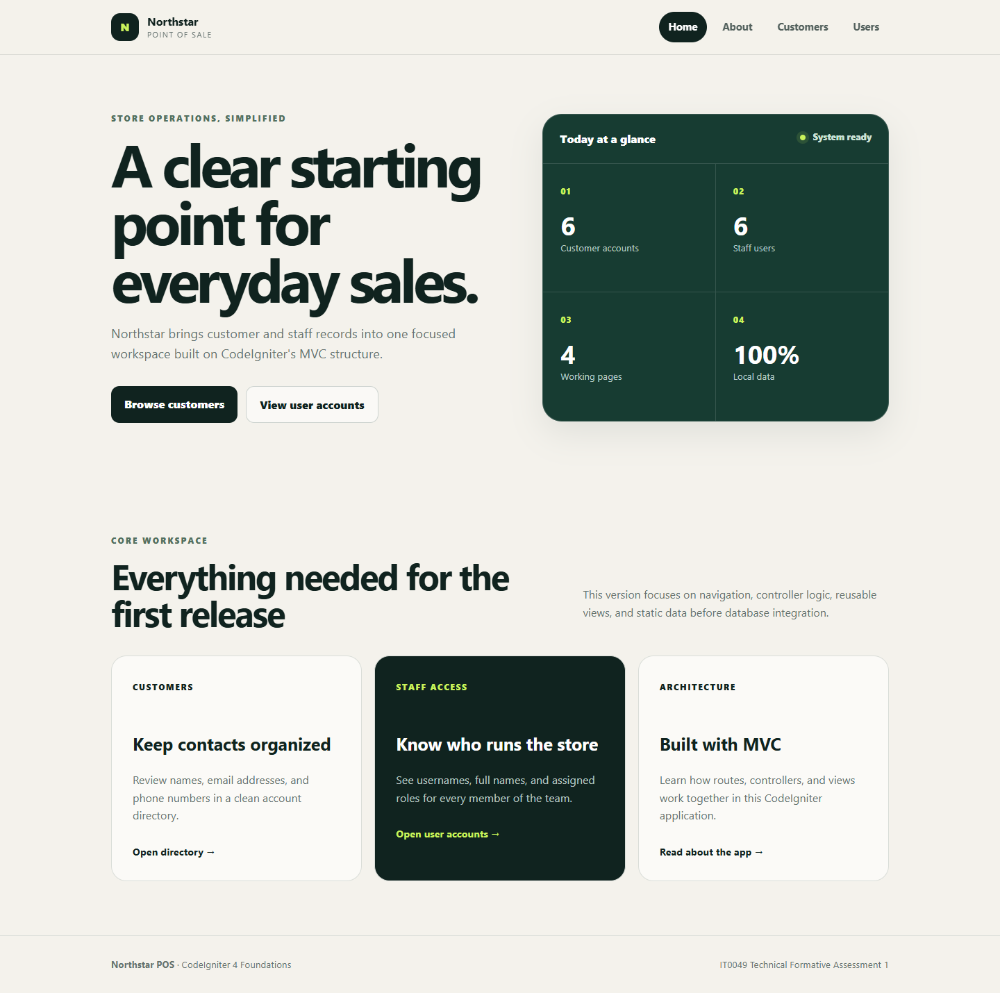
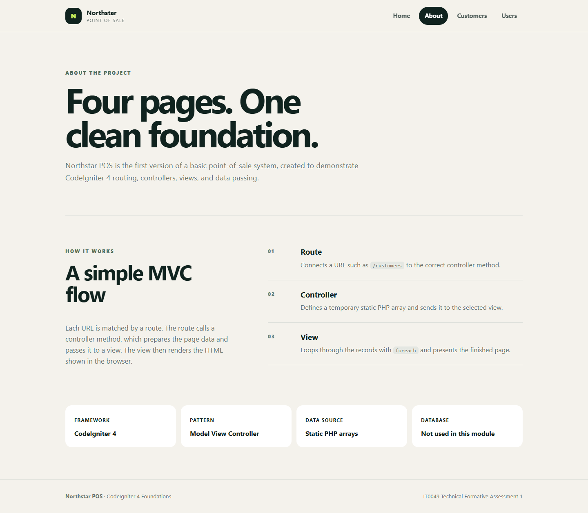
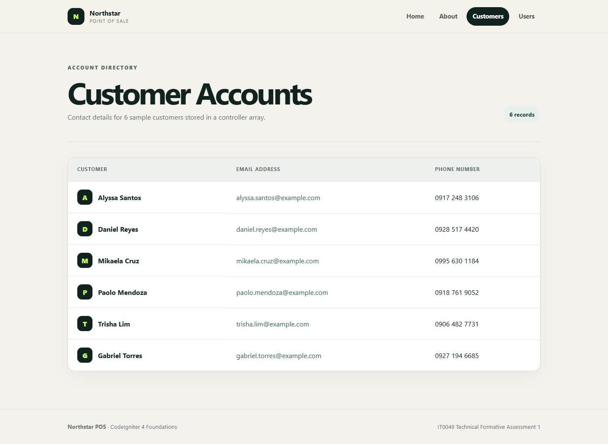
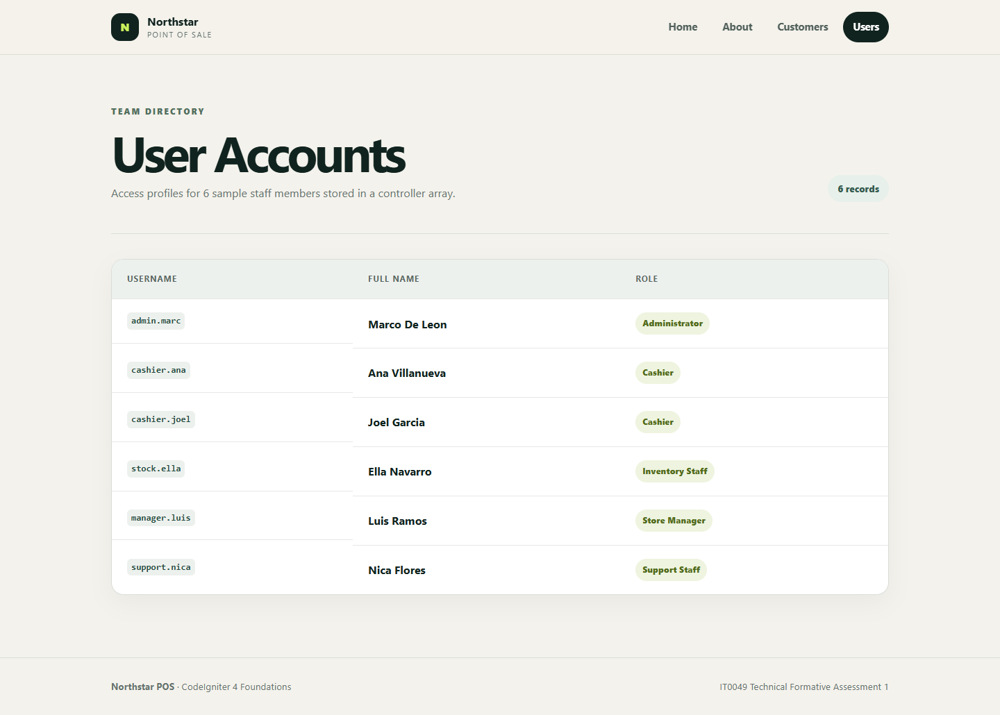

# Northstar POS

Northstar POS is a four-page CodeIgniter 4 application created for IT0049 Technical Formative Assessment 1. It demonstrates routing, controllers, views, shared layouts, and passing static array data to listing pages before database integration.

## Live website

[Open the deployed Northstar POS website](https://mbdeleon-Tech.github.io/IT0049-Technical-Fomative-Assessment-1-Module-1/)

GitHub Pages serves a static export generated from the same CodeIgniter views. The complete PHP application source remains on the `main` branch.

## Screenshots

### Landing page



### About page



### Customer accounts



### User accounts



## Pages

- `/` - landing page and system overview
- `/about` - project background and MVC flow
- `/customers` - customer accounts from a static PHP array
- `/users` - staff accounts from a static PHP array

## Requirements

- PHP 8.1 or newer with the extensions required by CodeIgniter 4
- Composer 2

## Setup

1. Clone this repository and open the project folder.
2. Run `composer install`.
3. Copy `env` to `.env`.
4. Confirm that `.env` contains `CI_ENVIRONMENT = development` and `app.baseURL = 'http://localhost:8080/'`.
5. Run `php spark serve`.
6. Open `http://localhost:8080` in a browser.

## Static deployment

With the local CodeIgniter server running, execute `powershell -ExecutionPolicy Bypass -File scripts/export-static.ps1`. The generated `docs` folder is the GitHub Pages deployment source.

## Project structure

- `app/Config/Routes.php` defines the four required routes.
- `app/Controllers/Pages.php` handles the landing and about pages.
- `app/Controllers/Customers.php` contains the temporary customer array.
- `app/Controllers/Users.php` contains the temporary staff array.
- `app/Views` contains the shared layout and four page views.
- `public/assets/css/app.css` contains the responsive interface styles.
- `tests/app/Feature/PagesTest.php` verifies the required routes and records.

## Data note

No database is used in this assessment. The `database/README.md` file documents why no SQL export is included.

## Run tests

```bash
composer test
```

## Student

- Marco Arsenio B. De Leon
- Section TC33
- Professor: Mr. Von Erick Magbitang
